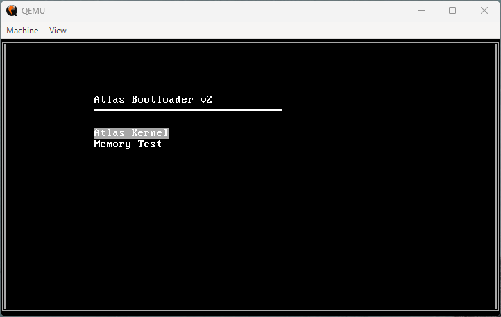
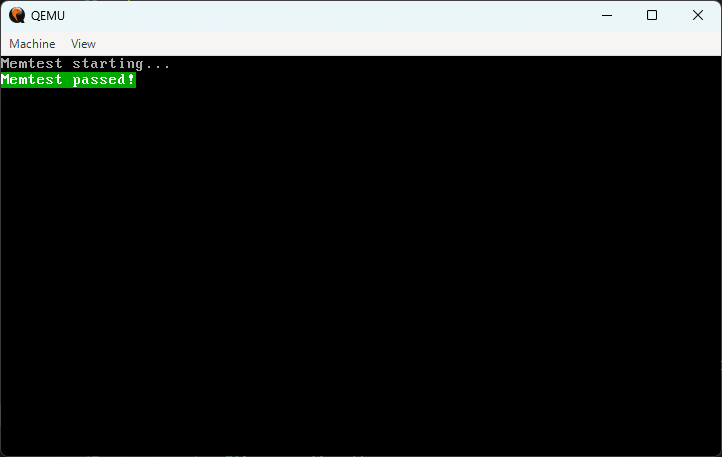
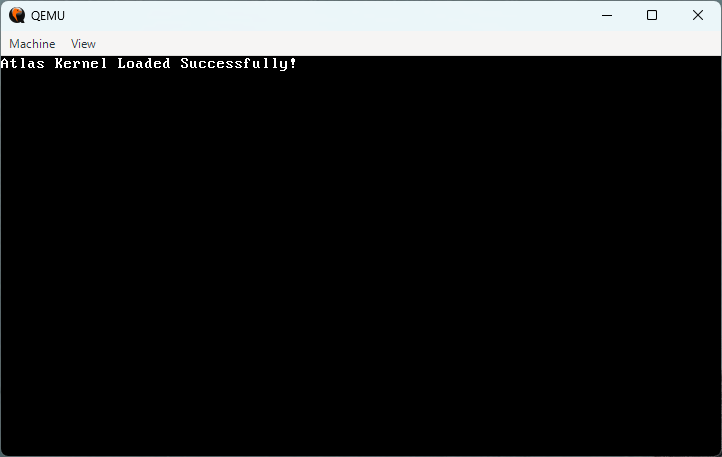

# Atlas Bootloader

Atlas is a modern, hobbyist-friendly x86 bootloader. It supports FAT32 filesystems, structured configuration for multiple boot entries, and an interactive VGA menu.

## Features

- **FAT32 Support**: Boots directly from a FAT32 partition.
- **Interactive Menu**: User-friendly VGA menu for selecting boot options.
- **Structured Configuration**: Define entries, kernels, and menu titles in `config/atlas.cfg`.
- **Multistage Design**:
  - **Stage 1 (VBR)**: Initializes disk and BIOS, loads Stage 2.
  - **Stage 2**: Searches for kernel/config and transitions to Protected Mode.
  - **Kernel**: Minimalist 32-bit kernel with heap, VGA, and keyboard drivers.

## Project Structure

- `src/boot/`: NASM assembly for Stage 1 & 2.
- `src/kernel/`: C sources for the kernel components.
- `include/`: Kernel header files.
- `config/`: Bootloader configuration (`atlas.cfg`).
- `scripts/`: Python utility for disk image creation.

## Building Atlas

### Requirements

- **CMake** (v3.15+)
- **NASM** (for bootloader)
- **Python 3** (for disk imaging)
- **QEMU** (optional, for running)
- **x86_64-elf-gcc** (Toolchain automatically downloaded by CMake)

### Steps

1. **Configure**:

   ```powershell
   cmake -B build
   ```

2. **Build**:

   ```powershell
   cmake --build build
   ```

3. **Run in QEMU**:

   ```powershell
   cmake --build build --target run
   ```

## Flashing to a USB Drive

You can write the generated `disk.img` to a physical USB drive using the included utility.

> [!CAUTION]
> This will erase all data on the target drive. Double-check your selection!

### Windows (Run as Administrator)

```powershell
python scripts/burn_usb.py
```

### Linux (Requires sudo)

```bash
sudo python3 scripts/burn_usb.py
```

The script will list available drives and ask for your confirmation before writing.

## Configuration

Modify `config/atlas.cfg` to add or remove boot entries:

```ini
[menu]
title=My Hobby OS

[entry]
name=Standard Boot
kernel=/BOOT/KERNEL.BIN

[entry]
name=Recovery Mode
kernel=/BOOT/RECOVERY.BIN
```

When building, the `scripts/create_disk.py` tool generates a 64MB FAT32 image containing your Stage 1, Stage 2, and the configuration file.

## Images

Below are some images showcasing the Atlas Bootloader:




